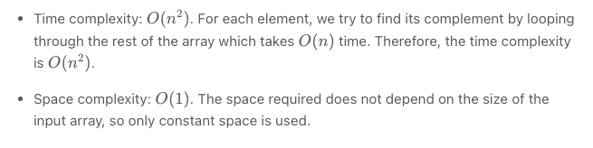
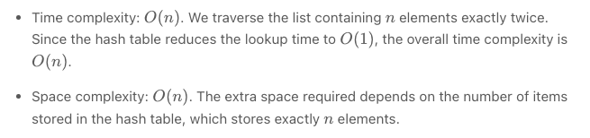
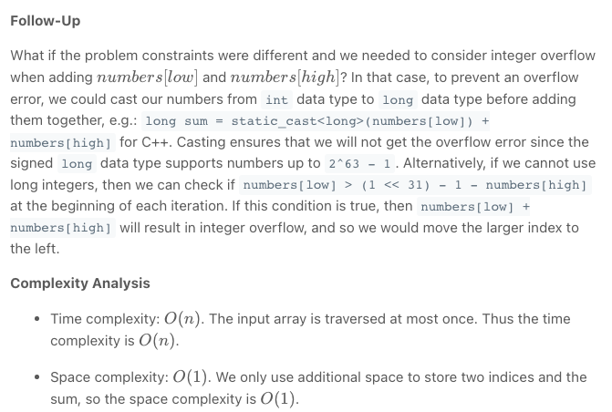
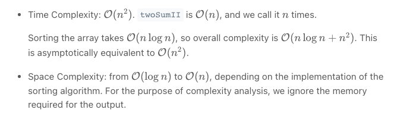

# Two Sum
# Two Sum II
# 3Sum

## Two Sum

### Approach : Brute Force
The brute force approach is simple. Loop through each element xx and find if there is another value that equals to target - x


```python
class Solution:
    def twoSum(self, nums: List[int], target: int) -> List[int]:
        for i in range(len(nums)):
            for j in range(i + 1, len(nums)):
                if nums[j] == target - nums[i]:
                    return [i, j]
```

Complexity Analysis



## Second Approach: Two Pass Hash Table

Intuition

To improve our runtime complexity, we need a more efficient way to check if the complement exists in the array. If the complement exists, we need to get its index. What is the best way to maintain a mapping of each element in the array to its index? A hash table.

We can reduce the lookup time from O(n) to O(1) by trading space for speed. A hash table is well suited for this purpose because it supports fast lookup in near constant time. I say "near" because if a collision occurred, a lookup could degenerate to O(n)O(n) time. However, lookup in a hash table should be amortized O(1) time as long as the hash function was chosen carefully.

Algorithm

A simple implementation uses two iterations. In the first iteration, we add each element's value as a key and its index as a value to the hash table. Then, in the second iteration, we check if each element's complement (target - nums[i]) exists in the hash table. If it does exist, we return current element's index and its complement's index. Beware that the complement must not be nums[i] itself!


```python
class Solution:
    def twoSum(self, nums: List[int], target: int) -> List[int]:
        hashmap = {}
        for i in range(len(nums)):
            hashmap[nums[i]] = i
        for i in range(len(nums)):
            complement = target - nums[i]
            if complement in hashmap and hashmap[complement] != i:
                return [i, hashmap[complement]] 
```

Complexity Analysis




## Two Sum II
### Approach : Two Pointers
Approach 1: Two Pointers
Algorithm

We can apply Two Sum's solutions directly to get O(n^2) time, O(1) space using brute force and O(n) time, O(n) space using hash table. However, both existing solutions do not make use of the property that the input array is sorted. We can do better.

We use two indices, initially pointing to the first and the last element, respectively. Compare the sum of these two elements with target. If the sum is equal to target, we found the exactly only solution. If it is less than target, we increase the smaller index by one. If it is greater than target, we decrease the larger index by one. Move the indices and repeat the comparison until the solution is found.

Let [... , a, b, c, ... , d, e, f, ...][...,a,b,c,...,d,e,f,...] be the input array that is sorted in ascending order and let the elements bb and ee be the exactly only solution. Because we are moving the smaller index from left to right, and the larger index from right to left, at some point, one of the indices must reach either bb or ee. Without loss of generality, suppose the smaller index reaches bb first. At this time, the sum of these two elements must be greater than target. Based on our algorithm, we will keep moving the larger index to the left until we reach the solution.


```python
def twoSum1(self, numbers, target):
    l, r = 0, len(numbers)-1
    while l < r:
        s = numbers[l] + numbers[r]
        if s == target:
            return [l+1, r+1]
        elif s < target:
            l += 1
        else:
            r -= 1
```

Complexity Analysis:




## Second Approach: Dictionary


```python
def twoSum2(self, numbers, target):
    dic = {}
    for i, num in enumerate(numbers):
        if target-num in dic:
            return [dic[target-num]+1, i+1]
        dic[num] = i 
```

Complexity Analysis

O(n) time and O(n) space


## Third Approach: Binary Search

```python
def twoSum(self, numbers, target):
    for i in xrange(len(numbers)):
        l, r = i+1, len(numbers)-1
        tmp = target - numbers[i]
        while l <= r:
            mid = l + (r-l)//2
            if numbers[mid] == tmp:
                return [i+1, mid+1]
            elif numbers[mid] < tmp:
                l = mid+1
            else:
                r = mid-1
```

Complexity Analysis

O(nlogn) time and O(1) space

## 3Sum

### Approach : Two Pointers

We will follow the same two pointers pattern as in Two Sum II. It requires the array to be sorted, so we'll do that first. As our BCR is O(n^2), sorting the array would not change the overall time complexity.

To make sure the result contains unique triplets, we need to skip duplicate values. It is easy to do because repeating values are next to each other in a sorted array.

If you are wondering how to solve this problem without sorting the array, go over the "No-Sort" approach below. There are cases when that approach is preferable, and your interviewer may probe your knowledge there.

After sorting the array, we move our pivot element nums[i] and analyze elements to its right. We find all pairs whose sum is equal -nums[i] using the two pointers pattern, so that the sum of the pivot element (nums[i]) and the pair (-nums[i]) is equal to zero.

As a quick refresher, the pointers are initially set to the first and the last element respectively. We compare the sum of these two elements to the target. If it is smaller, we increment the lower pointer lo. Otherwise, we decrement the higher pointer hi. Thus, the sum always moves toward the target, and we "prune" pairs that would move it further away. Again, this works only if the array is sorted. Head to the Two Sum II solution for the detailed explanation.


The implementation is straightforward - we just need to modify twoSumII to produce triplets and skip repeating values.

1. For the main function
   1. Sort the input array nums.
   2. Iterate through the array:
      1. If the current value is greater than zero, break from the loop. Remaining values cannot sum to zero.
      2. If the current value is the same as the one before, skip it.
      3. Otherwise, call twoSumII for the current position i.


- For twoSumII function:

1. Set the low pointer lo to i + 1, and high pointer hi to the last index.
2. While low pointer is smaller than high:
   1. If sum of nums[i] + nums[lo] + nums[hi] is less than zero, increment lo.
   2. If sum is greater than zero, decrement hi.
   3. Otherwise, we found a triplet:
        1. Add it to the result res.
        2. Decrement hi and increment lo.
        3. Increment lo while the next value is the same as before to avoid duplicates in the result.
3. Return the result res.


```python
class Solution:
    def threeSum(self, nums: List[int]) -> List[List[int]]:
        res = []
        nums.sort()
        for i in range(len(nums)):
            if nums[i] > 0:
                break
            if i == 0 or nums[i - 1] != nums[i]:
                self.twoSumII(nums, i, res)
        return res

    def twoSumII(self, nums: List[int], i: int, res: List[List[int]]):
        lo, hi = i + 1, len(nums) - 1
        while (lo < hi):
            sum = nums[i] + nums[lo] + nums[hi]
            if sum < 0:
                lo += 1
            elif sum > 0:
                hi -= 1
            else:
                res.append([nums[i], nums[lo], nums[hi]])
                lo += 1
                hi -= 1
                while lo < hi and nums[lo] == nums[lo - 1]:
                    lo += 1
```

Complexity Analysis
