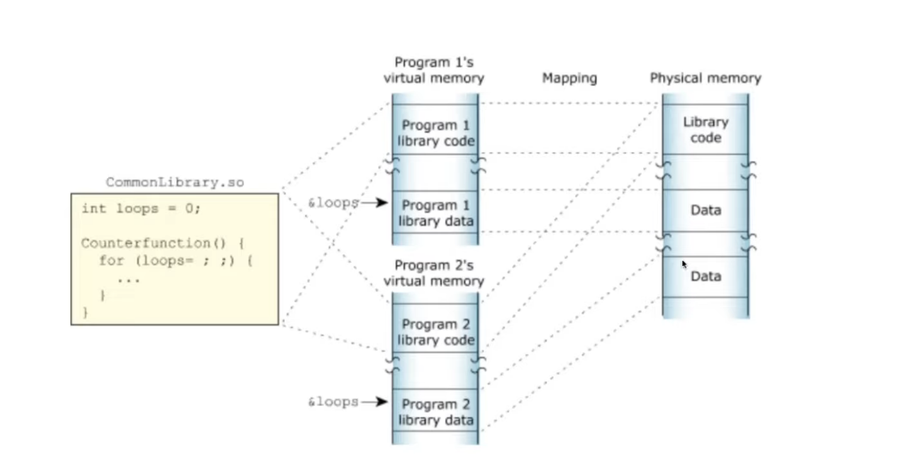

# What happens when you type ls into the terminal?

## Overview

### Type Command in `ls -l`

`$ ls -l`

### The Shell reads the command from the standard input

The getline() function reads the entered line as one string from standard input

`getline(&buffer,&size,stdin);`

The getline() function is prototyped in the stdio.h header file. Here are the three arguements

* `&buffer` - The address of the first character position where the input string will be stored. its not the base address of the buffer, but of the first character in the buffer. This pointer type causes massive confusion.
* `&size` is the address of the virable that holds the size of the input buffer, another pointer
* `stdin` ins the input file handle. So you could use getline() to read a line of text form a file, but when stdin is specified, standard input is read.

After reading the line and storing it in the buffer, the getline returns an int/ssize)t which is equal to

1. The number of characters read, on success, without including the terminating null byte of the string

or

2. -1, on failure to read a line including end of file conditions

### Breakdown commands into tokens

A string tokenization function is called which splits the command into tokens. In our shell we used a function caled `strtok()` which took the line to tokenize and the delimeter to define the token boundaries.

For example

`$ ls -la /`

We have the name of the binary `ls` and its arguments

The command could aslo be

`$ ls      -la    /`

We are going to write a function that will store our command without the spaces in a charr** which will give

`[ls][-la][/]`

### Check for shell expansion

After the command has been split into tokens or words expanded or resolved.

There are 8 expansions.

#### Brace Expansion

A mechanism by which arbitrary strings may be generated. Oatterns to be brace expanded take the form of an optional PREAMBLE, followed by a serires of comma-seperated strings between a pair of braces, followed by an optional POSTSCRIPT. The preable is prefixed to each string contained within the braces and the postscript is then appended to each resulting string.
Brace extensions may be nested, the results of each expanded string are not sorted. Left or right order is preserved.

```
franky ~> echo sp{el,il,al}l
spell spill spall
```

Brace expansion is performed before any other expansions, and any characters special to other expansions are preserved in the result. It is strictly textual. Bash does not apply any syntactic interpretation to the context of the expansion or the text between the braces. To avoid conflicts with parameter expansion, the string **"${"** is not considered eligible for brace expansion.

A correctly-formed brace expansion must contain unquoted opening and closing braces, and at least one unquoted comma. Any incorrectly formed brace expansion is left unchanged.

#### Tilde Expansion

If a word begins with an unquoted tilde character (**"~"**), all of the characters up to the first unquoted slash (or all characters, if there is no unquoted slash) are considered a *tilde-prefix* . If none of the characters in the tilde-prefix are quoted, the characters in the tilde-prefix following the tilde are treated as a possible login name. If this login name is the null string, the tilde is replaced with the value of the HOME shell variable. If HOME is unset, the home directory of the user executing the shell is substituted instead. Otherwise, the tilde-prefix is replaced with the home directory associated with the specified login name.

If the tilde-prefix is **"~+"**, the value of the shell variable PWD replaces the tilde-prefix. If the tilde-prefix is **"~-"**, the value of the shell variable OLDPWD, if it is set, is substituted.

If the characters following the tilde in the tilde-prefix consist of a number N, optionally prefixed by a **"+"** or a **"-"**, the tilde-prefix is replaced with the corresponding element from the directory stack, as it would be displayed by the **dirs** built-in invoked with the characters following tilde in the tilde-prefix as an argument. If the tilde-prefix, without the tilde, consists of a number without a leading **"+"** or **"-"**, **"+"** is assumed.

If the login name is invalid, or the tilde expansion fails, the word is left unchanged.

Each variable assignment is checked for unquoted tilde-prefixes immediately following a **":"** or **"="**. In these cases, tilde expansion is also performed. Consequently, one may use file names with tildes in assignments to PATH, MAILPATH, and CDPATH, and the shell assigns the expanded value.

Example:

```
franky ~> export PATH="$PATH:~/testdir"

```

~/testdir will be expanded to $$HOME is /var/home/franky, the directory /var/home/franky/testdir will be added to the content of the PATH variable.

#### Shell parameter and variable expansion

The "$" character introduces parameter expansion, command substitution, or arithmetic expansion. The parameter name or symbol to be expanded may be enclosed in braces, which are optional but serve to protect the variable to be expanded from characters immediately following it which could be interpreted as part of the name.
When braces are used, the matching ending brace is the first "}" not escaped by a backslash or within a quoted string, and not within an embedded arithmetic expansion, command substitution, or parameter expansion.

The basic form of parameter expansion is "${PARAMETER}". The value of "PARAMETER" is substituted. The braces are required when "PARAMETER" is a positional parameter with more than one digit, or when "PARAMETER" is followed by a character that is not to be interpreted as part of its name.

If the first character of "PARAMETER" is an exclamation point, Bash uses the value of the variable formed from the rest of "PARAMETER" as the name of the variable; this variable is then expanded and that value is used in the rest of the substitution, rather than the value of "PARAMETER" itself. This is known as indirect expansion.

You are certainly familiar with straight parameter expansion, since it happens all the time, even in the simplest of cases, such as the one above or the following:

```

franky ~> echo $SHELL
/bin/bash
The following is an example of indirect expansion:


franky ~> echo ${!N*}
NNTPPORT NNTPSERVER NPX_PLUGIN_PATH
Note that this is not the same as echo $N*.

The following construct allows for creation of the named variable if it does not yet exist:

${VAR:=value}

Example:


franky ~> echo $FRANKY

franky ~> echo ${FRANKY:=Franky}
Franky
Special parameters, among others the positional parameters, may not be assigned this way, however.


```

#### Command Subsitution

This allows the output of a command to replace the command itself. Command substitution occurs when command is enclosed like this

`$(command)`

or

command with quotes

Bash performs the expansion by executing COMMAND and replacing the command substitution with the standard output of the command, with any trailing newlines deleted. Embedded newlines are not deleted, but they may be removed during word splitting.

```
franky ~> echo `date`
Thu Feb 6 10:06:20 CET 2003
```

When the old-style backquoted form of substitution is used, backslash retains its literal meaning except when followed by **"$"**, **"`"**, or **"\"**. The first backticks not preceded by a backslash terminates the command substitution. When using the **"$(COMMAND)"** form, all characters between the parentheses make up the command; none are treated specially.

Command substitutions may be nested. To nest when using the backquoted form, escape the inner backticks with backslashes.

If the substitution appears within double quotes, word splitting and file name expansion are not performed on the results.

#### Arithmetic Expansion

This allows the evaluation of arithmetic expressions and the substitution of the result. The format for arithmetic.`$((EXPRESSION))`

The expression is treated as if it were within double quotes, but a double quote inside the parentheses is not treated specially. All tokens in the expression undergo parameter expansion, command substitution, and quote removal. Arithmetic substitutions may be nested.

Evaluation of arithmetic expressions is done in fixed-width integers with no check for overflow - although division by zero is trapped and recognized as an error. The operators are roughly the same as in the C programming language. In order of decreasing precedence, the list looks like this:

**Table 3-4. Arithmetic operators**

| Operator                                    | Meaning                                    |
| ------------------------------------------- | ------------------------------------------ |
| VAR++ and VAR--                             | variable post-increment and post-decrement |
| ++VAR and --VAR                             | variable pre-increment and pre-decrement   |
| - and +                                     | unary minus and plus                       |
| ! and ~                                     | logical and bitwise negation               |
| **                                          | exponentiation                             |
| *, / and %                                  | multiplication, division, remainder        |
| + and -                                     | addition, subtraction                      |
| << and >>                                   | left and right bitwise shifts              |
| <=, >=, < and >                             | comparison operators                       |
| == and !=                                   | equality and inequality                    |
| &                                           | bitwise AND                                |
| ^                                           | bitwise exclusive OR                       |
|                                             |                                            |
| &&                                          | logical AND                                |
|                                             |                                            |
| expr ? expr : expr                          | conditional evaluation                     |
| =, *=, /=, %=, +=, -=, <<=, >>=, &=, ^= and | =                                          |
| ,                                           | separator between expressions              |

#### Process Substitution

Process substitution is supported on systems that support named pipes (FIFOs) or the /dev/fd method of naming open files. It takes the form of

`<(LIST)`

or

`>(LIST)`

The process LIST is run with its input or output connected to a FIFO or some file in /dev/fd. The name of this file is passed as an argument to the current command as the result of the expansion. If the ">(LIST)" form is used, writing to the file will provide input for LIST. If the "<(LIST)" form is used, the file passed as an argument should be read to obtain the output of LIST. Note that no space may appear between the < or > signs and the left parenthesis, otherwise the construct would be interpreted as a redirection.

When available, process substitution is performed simultaneously with parameter and variable expansion, command substitution, and arithmetic expansion.

#### Word splitting

The shell scans the results of parameter expansion, command substitution, and arithmetic expansion that did not occur within double quotes for word splitting.

The shell treats each character of $IFS as a delimiter, and splits the results of the other expansions into words on these characters. If IFS is unset, or its value is exactly "'`<space><tab>``<newline>`'", the default, then any sequence of IFS characters serves to delimit words. If IFS has a value other than the default, then sequences of the whitespace characters "space" and "Tab" are ignored at the beginning and end of the word, as long as the whitespace character is in the value of IFS (an IFS whitespace character). Any character in IFS that is not IFS whitespace, along with any adjacent IF whitespace characters, delimits a field. A sequence of IFS whitespace characters is also treated as a delimiter. If the value of IFS is null, no word splitting occurs.

Explicit null arguments ("""" or "''") are retained. Unquoted implicit null arguments, resulting from the expansion of parameters that have no values, are removed. If a parameter with no value is expanded within double quotes, a null argument results and is retained.

Note	Expansion and word splitting

If no expansion occurs, no splitting is performed.

#### File name expansion

After word splitting, unless the -f option has been set (see Section 2.3.2), Bash scans each word for the characters "*", "?", and "[". If one of these characters appears, then the word is regarded as a PATTERN, and replaced with an alphabetically sorted list of file names matching the pattern. If no matching file names are found, and the shell option nullglob is disabled, the word is left unchanged. If the nullglob option is set, and no matches are found, the word is removed. If the shell option nocaseglob is enabled, the match is performed without regard to the case of alphabetic characters.

When a pattern is used for file name generation, the character "." at the start of a file name or immediately following a slash must be matched explicitly, unless the shell option dotglob is set. When matching a file name, the slash character must always be matched explicitly. In other cases, the "." character is not treated specially.

The GLOBIGNORE shell variable may be used to restrict the set of file names matching a pattern. If GLOBIGNORE is set, each matching file name that also matches one of the patterns in GLOBIGNORE is removed from the list of matches. The file names . and .. are always ignored, even when GLOBIGNORE is set. However, setting GLOBIGNORE has the effect of enabling the dotglob shell option, so all other file names beginning with a "." will match. To get the old behavior of ignoring file names beginning with a ".", make ".*" one of the patterns in GLOBIGNORE. The dotglob option is disabled when GLOBIGNORE is unset.

### Check for alias

An alias allows a string to be substituted for a word when it is used as the first word of a simple command. The shell maintains list of aliases and unalias built-in commands.

```
franky: ~> alias
alias ..='cd ..'
alias ...='cd ../..'
alias ....='cd ../../..'
alias PAGER='less -r'
alias Txterm='export TERM=xterm'
alias XARGS='xargs -r'
alias cdrecord='cdrecord -dev 0,0,0 -speed=8'
alias e='vi'
alias egrep='grep -E'
alias ewformat='fdformat -n /dev/fd0u1743; ewfsck'
alias fgrep='grep -F'
alias ftp='ncftp -d15'
alias h='history 10'
alias fformat='fdformat /dev/fd0H1440'
alias j='jobs -l'
alias ksane='setterm -reset'
alias ls='ls -F --color=auto'
alias m='less'
alias md='mkdir'
alias od='od -Ax -ta -txC'
alias p='pstree -p'
alias ping='ping -vc1'
alias sb='ssh blubber'
alias sl='ls'
alias ss='ssh octarine'
alias tar='gtar'
alias tmp='cd /tmp'
alias unaliasall='unalias -a'
alias vi='eval `resize`;vi'
alias vt100='export TERM=vt100'
alias which='type'
alias xt='xterm -bg black -fg white &'

franky ~>
```

### Is the command a builtin command?

A builtin command are standard commands that come with linux distributions.

* alias
* bind
* builtin
* caller
* command
* declare
* echo
* enable
* help
* local
* logout
* mapfile
* printf
* read
* readarray
* source
* type
* typeset
* ulimit
* unalias

### Find the location of the executable program in paths defined in $PATH

PATH is an environmental variable in Linux os that tells the shell which directories to search for executable files in response to commands issued by the user. Most important env var.
If the command is not found in the BUILTIN command list then it will look at the PATH env variable.

It is a simple matter to add a directory to a user's PATH variable (and thereby add it to the user's default search path). It can be accomplished for the current session by using the following command, in which directory is the full path of the directory to be entered:

`PATH="directory:$PATH"`

For example, to add the directory /usr/sbin, the following would be used:

`PATH="/usr/sbin:$PATH"`

An alternative is to employ the export command, which is used to change aspects of the environment. Thus, the above absolute path could be added with the following two commands in sequence

`PATH=$PATH:/usr/sbin  `

`export PATH`

or its single-line equivalent

`export PATH=$PATH:/usr/sbin`

That the directory has been added can be easily confirmed by again using the echo command with $PATH as its argument.

### What if the program is not found?

Return an error if the command is not found

**The error “Command not found” means that the command isn’t in your search path.**

When you get the error “Command not found,” it means that the computer searched everywhere it knew to look and couldn’t find a program by that name.

You can control where the computer looks for commands, however. So “Command not found” doesn’t necessarily mean that the program isn’t anywhere on the system. It may just mean that you didn’t give the computer enough information to find it. Before you ask your administrator for help, there are a few things you can do:

* Check the name of the command and confirm that you didn’t make a typo on the command line.
* Make sure that the command is installed on the system.
* If the command is installed on your system, make sure the computer knows where to look.

If the shell doesn’t find any built-ins, then it will look for the “ls” executable specified by the PATH env, or environment, variable. The shell will search through this variable when the user enters a command.


By using the fork function the shell splits into two processes, the parent and the child. While the parent waits, the child executes the command by receiving the path of the command "/bin/ls", the tokens ["ls", "-l"] and the environment "envp". The function execve, executes and transforms into the execution of "/bin/ls" and the child process exits when "/bin/ls" exits.

And this is what it takes for the shell to list files in long form with the command “ls -l” and you get this result


Hope i explained it well for all of you , its pretty amazing what goes on under the hood for simple commands like this

### Virtual and Physical Memory

The shared libraries are stored in physical memory and virtual memory is mapped to it. Notice how the library code only exists in the Physical Memory once.


