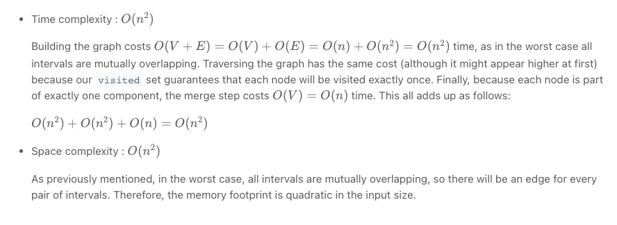
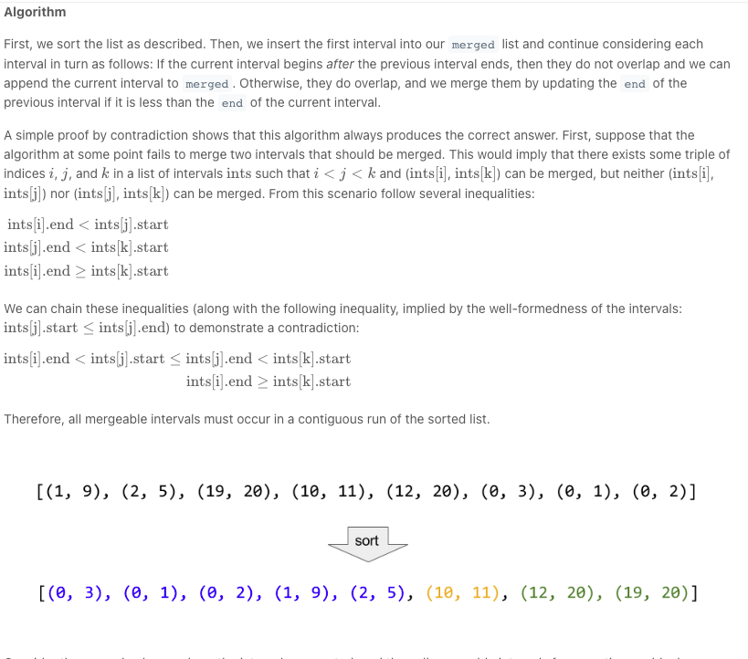

# Merge Intervals

Given an array of `intervals` where `intervals[i] = [start^i, end^i]`, merge all overlapping intervals, and return *an array of the non-overlapping intervals that cover all the intervals in the input*.


```
Input: intervals = [[1,3],[2,6],[8,10],[15,18]]
Output: [[1,6],[8,10],[15,18]]
Explanation: Since intervals [1,3] and [2,6] overlaps, merge them into [1,6].


Input: intervals = [[1,4],[4,5]]
Output: [[1,5]]
Explanation: Intervals [1,4] and [4,5] are considered overlapping.
```

## First Approach

Approach 1: Connected Components

**Intuition**

If we draw a graph (with intervals as nodes) that contains undirected edges between all pairs of intervals that overlap, then all intervals in each *connected component* of the graph can be merged into a single interval.

**Algorithm**

With the above intuition in mind, we can represent the graph as an adjacency list, inserting directed edges in both directions to simulate undirected edges. Then, to determine which connected component each node is it, we perform graph traversals from arbitrary unvisited nodes until all nodes have been visited. To do this efficiently, we store visited nodes in a `Set`, allowing for constant time containment checks and insertion. Finally, we consider each connected component, merging all of its intervals by constructing a new `Interval` with `start` equal to the minimum start among them and `end` equal to the maximum end.

This algorithm is correct simply because it is basically the brute force solution. We compare every interval to every other interval, so we know exactly which intervals overlap. The reason for the connected component search is that two intervals may not directly overlap, but might overlap indirectly via a third interval. See the example below to see this more clearly.


Although (1, 5) and (6, 10) do not directly overlap, either would overlap with the other if first merged with (4, 7). There are two connected components, so if we merge their nodes, we expect to get the following two merged intervals:

(1, 10), (15, 20)


```python
class Solution:
    def overlap(self, a, b):
        return a[0] <= b[1] and b[0] <= a[1]

    # generate graph where there is an undirected edge between intervals u
    # and v iff u and v overlap.
    def buildGraph(self, intervals):
        graph = collections.defaultdict(list)

        for i, interval_i in enumerate(intervals):
            for j in range(i+1, len(intervals)):
                if self.overlap(interval_i, intervals[j]):
                    graph[tuple(interval_i)].append(intervals[j])
                    graph[tuple(intervals[j])].append(interval_i)

        return graph

    # merges all of the nodes in this connected component into one interval.
    def mergeNodes(self, nodes):
        min_start = min(node[0] for node in nodes)
        max_end = max(node[1] for node in nodes)
        return [min_start, max_end]

    # gets the connected components of the interval overlap graph.
    def getComponents(self, graph, intervals):
        visited = set()
        comp_number = 0
        nodes_in_comp = collections.defaultdict(list)

        def markComponentDFS(start):
            stack = [start]
            while stack:
                node = tuple(stack.pop())
                if node not in visited:
                    visited.add(node)
                    nodes_in_comp[comp_number].append(node)
                    stack.extend(graph[node])

        # mark all nodes in the same connected component with the same integer.
        for interval in intervals:
            if tuple(interval) not in visited:
                markComponentDFS(interval)
                comp_number += 1

        return nodes_in_comp, comp_number


    def merge(self, intervals: List[List[int]]) -> List[List[int]]:
        graph = self.buildGraph(intervals)
        nodes_in_comp, number_of_comps = self.getComponents(graph, intervals)

        # all intervals in each connected component must be merged.
        return [self.mergeNodes(nodes_in_comp[comp]) for comp in range(number_of_comps)]

```

Complexity Analysis




### Second Approach

Approach 2: Sorting


```python
class Solution:
    def merge(self, intervals: List[List[int]]) -> List[List[int]]:
        # O(n log n)
        intervals.sort.(key= lambda i : i [0])
        output = [intervals[0]]

        for start, end in intervals[1:]:
            lastEnd = output[-1][1]

            if start <= lasEnd:
                output[-1][1] = max(lastEnd, end)
            else:
                output.append([start, end])
        return output
```

Complexity Analysis


