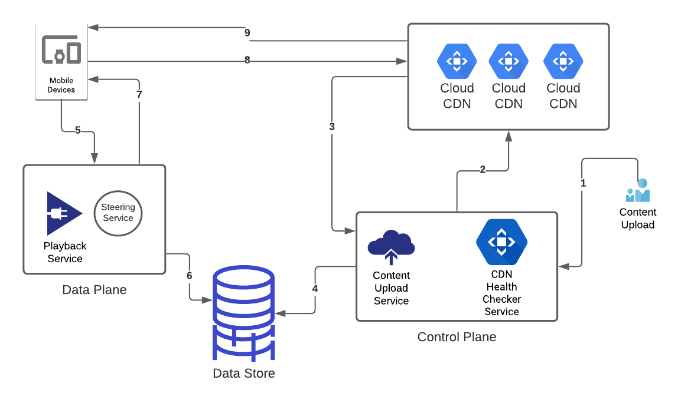
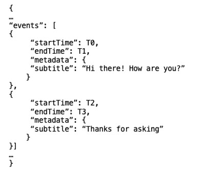
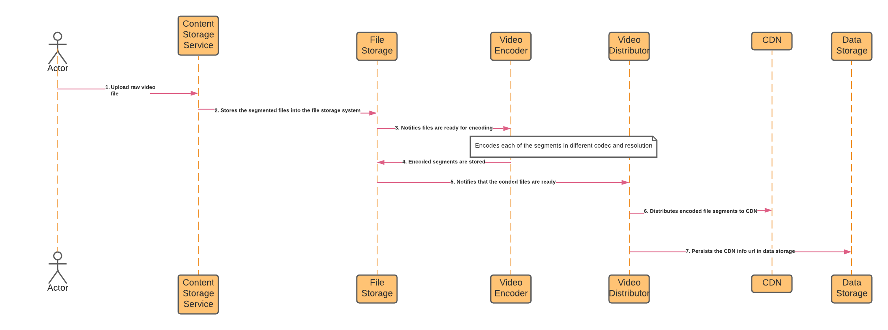
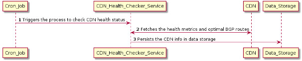
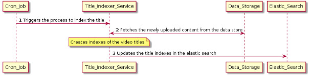
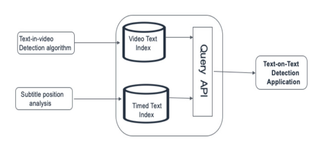

# Designing Netflix

## Problem Statement

Design a video streaming platform similar to Netflix. Content creators can upload their video and viewers are able to play the videos on different devices. We should also be able to store user statistics of the videos such as a number of views, videos watched, duration... etc

## Gather Requirements

### In Scope

* Content Creators should be able to upload content at a designated time.
* The viewers are able to watch the video on different platforms (TV, mobile, etc).
* User should be able to search videos based on titles.
* The system should support subtitles for videos.

### Out of Scope

* The mechanism to recommend personalized videos to different users.
* Billing and Subscription model

## Capacity Planning

* What are the number of active daily users? DAU
  * 100 Million
* What is the average size of videos being uploaded per minute?
  * 2500 MB
* What is the total combinations of resolutions and codec formats which need to be supported?
  * 10
* What is the Average Number of Video users watch a day?
  * 3

The `Playback Microservice` is responsible for playback requests and requires many servers.

How do we calculate the amount of servers we need?

`Total Servers = `

`(Number of Playback Requests per Sec * Latency) / Number of Concurrent Connections per Server`

* Latency 20ms
* Max Connections 10k
* Scale to 75% of DAU Requesting Playback

`150 Total Servers = (75M*20ms/10K)`

Number of Videos watched per second = (Num of Active Users * Number of Average Videos Watched Daily) / 86400 Sec

* `(100 Million * 3 / 86400) = VWPS 3472`

Size of the content stored on a daily basis = ( average size of video uploaded per min * Num of pairwise combination of resolutions and codecs * 24 * 60 = 36TB/day)

* `2500MB * 10 * 24 * 60 = 36,000,000MB`
* `36,000,000 / 1024 = 36,000GB`
* `36,000 / 1024 = 36TB`
* `36TB` a day of Uploaded videos

## High Level Design

We have two user types

1. Content Creators
2. Viewers

* Content Distributor Network: Stores content in the locations which are geographically closts to users.
  * Open Connect is the global cusom CDN for netflix
* Control Plane: Component that handles uploads from content creators that will eventually hit CDNs
  * CDN Health Checker Service: This will check the health of the CDN periodically based on playback experience
  * Content Uploader Service: This will consume the content from creators and distribute it to CDNS to ensure robust playback experience. Also, stores metadata of video content.
* Data Storage: Video metadata is saved in the data storage. Including subtitle information in the optimal db
* Data Plane: Component that will interact with endusers for playback. Different platforms and returns urls of CDNs with the files requested
  * Playback Service
    * The service will determine the files that are required for playback
    * Get all URLS
  * Steering Service
    * This service determines the optimal CDN urls from which requested playback can be fetched from
    * Select best URLS

Diagram


Steps

1. The content creators upload the video content to the control plane.
2. The video content gets uploaded on the CDN which are placed geographically closer to end users.
3. The CDN reports the status to the control plane such as health metrics, what files they have stored, the optimal BGP routes and so forth.
4. The video metadata and the related CDN information gets persisted in the data storage.
5. A user on the client device places the request to play a particular title (TV show or movie).
6. Playback service determines the files which are required to playback a specific title.
7. The Steering service picks the optimal CDNs from which the required files can be fetched from. It generates the urls of such CDNs and provide it to back to the client device.
8. Client device requests the CDNs to serve the requested files.
9. CDN serves the requested files to the client device which gets rendered to the users.

## API Design

#### Video Upload

Path:

POST /video-contents/v1/videos

Body:

```
{
	videoTitle : Title of the video
	videoDescription : Description of the video
	tags : Tags associated with the video
	category : Category of the video, e.g. Movie, TV Show, 
	videoContent: Stream of video content to be uploaded
}
```

#### Search Video

Path:

GET /video-contents/v1/{$search-query}

Query Parameter:

`{ user-location: location of the user performing search } `

#### Stream Video

Path:

GET /video-contents/v1/videos/

Query Parameter:

```
{
	offset: Time in seconds from the beginning of the video
}
```

### Data Model

We need to store video metadata and its subtitles to the database. The metadata can be stored in an aggregate oriented database and given that the metadata will update frequently we can use MongoDB NoSQL

| VideoID         |
| :-------------- |
| title           |
| description     |
| cdn_urls        |
| content_creator |
| cast_members    |

We can also use a time-series database such as OpenTSDB which builds on top of cassandra to store subtitles. The data-model below shows how subtitles can be stored.



**FUN FACT** : In this [talk](https://www.youtube.com/watch?v=OQK3E21BEn8), Rohit Puri from Netflix, talks about the Netflix Media Database([NMDB](https://netflixtechblog.com/netflix-mediadatabase-media-timeline-data-model-4e657e6ffe93)) which is modeled around the notion of a media timeline with spatial properties. NMDB is desired to be a highly-scalable, multi-tenant, media metadata system which can serve near real-time queries and can serve high read/write throughput. The structure of the media timeline data model is called a “**Media Document** ”

### Component Design

### Control Plane

This component will mainly comprise of three modules: Content Uploader, CDN Health Checker, and Title Indexer. Each of these modules will be a micro-service performing a specific task. We have covered details of each of these modules in the section below.

#### Content Uploader

This module will execute when the creators upload content. Its responsible for distributing content to CDN


The diagram above depicts the sequence of operations which gets executed when content creators upload the video content (TV Show or movie).

1. The content creator uploads the raw video content which can be TV Show or movie.
2. The Content_Storage_Service segments the raw video file into chunks and persists those segments on the file storage system.
3. The Video_Encoder encodes each of the segments in different codec and resolution.
4. The encoded file segments are stored in the file storage.
5. The Video_Distributor reads the encoded file segments from the distributed file storage system.
6. The Video_Distributor distributes the encoded file segments in CDN.
7. The Video_Distributor persists the CDN url links of the videos in the data_storage.

#### Video Encoder

The encode works by

1. Splitting the video file into smaller segments
   1. These segments are encoded in all possible combinations
   2. Cinek, MPEG-2, h264, VP8 and Resolutions 240p, 480p, and 720p
   3. Each segment will have 12 formats (4 codecs * 3 resolutions)
2. These segments get distributed to the CDNs and the URLs to them are stored in our Data Store.
3. The playback API is reposible for finding the most optimal CDN url based on the input parameters of user requests
   1. (clients device, bandwidth, location)

FUN FACT: Netflix’s media processing platform is used for video encoding(FFmpeg), title image generation, media processing(Archer) and so forth. They have developed a tool called MezzFS which collects metrics on data throughput, download efficiency, resource usage, etc. in Atlas, Netflix’s in-memory time-series database. They use this data for developing optimizations such as replays and adaptive buffering.

#### CDN Health Checker

This module consumes health metrics from the CDNs and keeps them in the data store.
This information is used by the data plan to get optimal CDN file url for playback




In the image above, we have shown the sequence of operations which gets executed to get statistics around the CDN health metrics and the BGP routes. The details about each of the steps in the sequence diagram are listed below.

The cron job triggers the microservice (CDN_Health_Checker_Service) responsible for checking the health of CDNs.
The CDN_Health_Checker_Service is responsible for checking the health of CDNs and collect health metrics and other information.
The CDN_Health_Checker_Service persists the CDN info in the data store which is then used in the data-plane to find the optimal CDNs from which files can be served based on their file availability, health, and network proximity to the client.

#### Title Indexer

This module is responsible for creating the indezes of the videos titles and updates them in the elastic search to enable faster cotent discovery for users.



The details of the sequence of operations required for indexing the video titles for searching video content are listed below.

1. The cron-job triggers the Title_Indexer_Service to index the video titles.
2. The Title_Indexer_Service fetches the newly uploaded content from the data-store and applies the business rules to create indexes for the video titles.
3. Title_Indexer_Service updates Elastic_Search with the indexes of the video titles making the titles easily searchable.

#### Data Plane

This Component will be processing the user requests in real time and will comprise of two major workflows. Playback and Cotent Discovery.


#### Playback Workflow

This workflow is responsible for orchestrating operations when a user places a playaback request. it corredinates between different microservices such Authorizations service, Steering service for decideing the best playback experience, and the PLayback Experience service for tracking the events to measure playback experience. Steering service ensures the best customer  experience by finding the most optimal CDN url.


The details about each of the steps in the sequence diagram is listed below.

1. The client places a request to playback a video which gets directed to the Playback_Service.
2. The Playback_Service calls the Authorization_Service to authenticate users request.
3. The Playback_Service calls the Steering_Service to pick the CDN url from which the playback can be served.
4. The CDN url is returned to the client(mobile/TV).
5. The client retrieves the content from CDN.
6. The client publishes the events for the playback experience to the Playback_Service.
7. The Playback_Service tracks events to measure the playback experience by calling the Playback_Experience_Service.

**FUN FACT** : As mentioned in this [talk](https://www.youtube.com/watch?v=6oPj-DW09DU) by Netflix Engineer Suudhan Rangarajan, [gRPC](https://grpc.io/) is used as the framework for communication between different micro-services at Netflix. The advantages it provides over REST include: bi-directional streaming, minimum operational coupling and support across languages and platforms

#### Content Lookup Workflow

This workflow is triggered when user searches for a video title and comprises of two microservices: Content Discovery Service and Content Similarity Service. The Content Discovery Service gets invoked when user requests for the video title. On the other hand, the Content Similarity Service returns the list of similar video title if the exact video title doesn’t exist in our data-store.


We have listed below details of each of the steps involved in the Content Lookup Workflow.

1. The client searches for a video title.
2. The Content Discovery Service (CDS) queries the Elastic Search to check if the video title exists in our database.
3. If the video title can be found in the elastic search then CDS fetches the details of the video from the data store.
4. The video details are returned to the client.
5. CDS queries the Content Similarity Service (CSS) if the title doesn’t exist in our database. CSS returns the list of similar video titles to CDS.
6. CDS fetches the video details from the data-store for those similar video titles.
7. CDS returns the similar video details to the client.

### Optimizations

Optimize latency of the Playback Workflow by caching the CDN information This cache will be used by the steering service to prick the cdns from which the video content would be served.

We can work towards optimizing the latency of the Playback Workflow by caching the CDN information. This cache will be used by the steering service to pick the CDNs from which the video content would be served. We can further enhance performance of the playback operation by making the architecture asynchronous. Let’s try to understand it further using example of the playback api(getPlayData()) which requires customer(getCustomerInfo()) and device information(getDeviceInfo()) to process(decidePlayData()) a video playback request. Suppose each of the three operations(getCustomerInfo(), getDeviceInfo(), and decidePlayData()) depend on different microservices.

The synchronous implementation of the getPlayData() operation will look similar to the code snippet shown below. Such an architecture will comprise of two types of thread-pools: request-handler thread-pool and client thread-pools (for each of the micro-services). For each playback request, an execution thread from the request-response thread-pool gets blocked until the getPlayData() call gets finished. Each time getPlayData() is invoked, an execution thread(from the request-handler thread-pool) interacts with the client thread-pools of the dependent microservices. It is blocked until the execution is completely finished. It works for a simple request/response model where latency isn’t a concern, and the number of clients is limited.

```
PlayData getPlayData(String customerId, String titleId, String deviceId) {
	CustomerInfo custInfo = getCustomerInfo(customerId);
            DeviceInfo deviceInfo = getDeviceInfo(deviceId);
            PlayData playData = decidePlayData(custInfo, deviceInfo, titleId);
            return playData;
}
```

One way to scale out the playback operation is to split the operation into independent processes which can be executed in-parallel and re-assembled together. This can be done by using an asynchronous architecture comprising of event-loops for handling request-responses and client-interactions along-with worker threads. We have shown the asynchronous processing of the playback requests in the image below


### Addressing Bottlenecks

The usage of micro-services comes with the caveat of efficiently handling fallbacks, retries and time-outs while calling other services. We can address the bottlenecks of using distributed systems by using the concepts of [Chaos Engineering](https://en.wikipedia.org/wiki/Chaos_engineering), interestingly devised at Netflix. We can use tools such as [Chaos Monkey](https://netflix.github.io/chaosmonkey/) which randomly terminates instances in production to ensure that services are resilient to instance failures.

We may introduce chaos in the system by using the concepts of [Failure Injection Testing](https://netflixtechblog.com/fit-failure-injection-testing-35d8e2a9bb2)(FIT). This can be done by either introducing latency in the I/O calls or by injecting faults while calling other services. After that, we can implement fallback strategies by either returning latest cached data from the failing service or using a fallback microservice. We can also use libraries such as [Hystrix](https://netflixtechblog.com/introducing-hystrix-for-resilience-engineering-13531c1ab362) for isolating the points of access between failing services. Hystrix acts as circuit breakers if the error threshold gets breached. We should also ensure that the retry time-outs, service call time-outs, and the hystrix time-outs are in sync.

**FUN FACT** : In this [presentation](https://www.youtube.com/watch?v=RWyZkNzvC-c) by Nora Jones (Chaos Engineer at Netflix), the importance and different strategies of resilience testing at Netflix is discussed at length. She has provided key pointers which engineers should keep in mind while designing microservices for resiliency and to ensure that optimal design decisions are in place on a continuous basis.

### Extended Requirements

A common issue observed while streaming a video is that the subtitle appears on top of a text in the video (called the text-on-text issue). The issue is illustrated in the image below. How can we extend the current solution and the data model to detect this issue?


We can extend the existing Media Document solution (used for video subtitles) to store the video media information as well. We can then run Text-in-video detection and subtitle positioning algorithms on the media document data store and persist the results as separate indexes. After that, these indexes will be queried by the Text-on-Text detection application to identify any overlap, which will detect the text-on-text issue.



