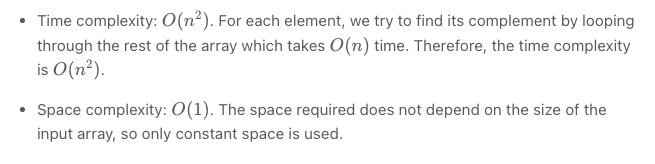

# Two Sum, Two Sum II, 3 Sum

## Two Sum
### Approach : Brute Force
The brute force approach is simple. Loop through each element xx and find if there is another value that equals to target - x


```python
class Solution:
    def twoSum(self, nums: List[int], target: int) -> List[int]:
        for i in range(len(nums)):
            for j in range(i + 1, len(nums)):
                if nums[j] == target - nums[i]:
                    return [i, j]
```

Complexity Analysis



## Second Approach: Two Pass Hash Table

Intuition

To improve our runtime complexity, we need a more efficient way to check if the complement exists in the array. If the complement exists, we need to get its index. What is the best way to maintain a mapping of each element in the array to its index? A hash table.

We can reduce the lookup time from O(n) to O(1) by trading space for speed. A hash table is well suited for this purpose because it supports fast lookup in near constant time. I say "near" because if a collision occurred, a lookup could degenerate to O(n)O(n) time. However, lookup in a hash table should be amortized O(1) time as long as the hash function was chosen carefully.

Algorithm

A simple implementation uses two iterations. In the first iteration, we add each element's value as a key and its index as a value to the hash table. Then, in the second iteration, we check if each element's complement (target - nums[i]) exists in the hash table. If it does exist, we return current element's index and its complement's index. Beware that the complement must not be nums[i] itself!


```python
class Solution:
    def twoSum(self, nums: List[int], target: int) -> List[int]:
        hashmap = {}
        for i in range(len(nums)):
            hashmap[nums[i]] = i
        for i in range(len(nums)):
            complement = target - nums[i]
            if complement in hashmap and hashmap[complement] != i:
                return [i, hashmap[complement]] 
```

Complexity Analysis

