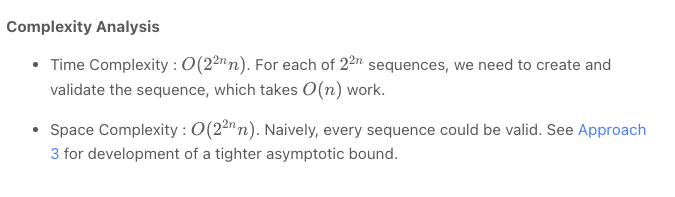
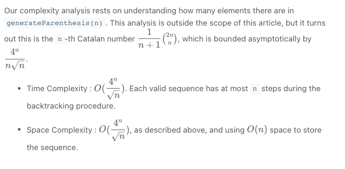

# Valid Parenthesis

## Approach 1: Brute Force
Intuition

We can generate all 2^{2n}2 
2n
  sequences of '(' and ')' characters. Then, we will check if each one is valid.

Algorithm

To generate all sequences, we use a recursion. All sequences of length n is just '(' plus all sequences of length n-1, and then ')' plus all sequences of length n-1.

To check whether a sequence is valid, we keep track of balance, the net number of opening brackets minus closing brackets. If it falls below zero at any time, or doesn't end in zero, the sequence is invalid - otherwise it is valid.


```python
class Solution(object):
    def generateParenthesis(self, n):
        def generate(A = []):
            if len(A) == 2*n:
                if valid(A):
                    ans.append("".join(A))
            else:
                A.append('(')
                generate(A)
                A.pop()
                A.append(')')
                generate(A)
                A.pop()

        def valid(A):
            bal = 0
            for c in A:
                if c == '(': bal += 1
                else: bal -= 1
                if bal < 0: return False
            return bal == 0

        ans = []
        generate()
        return ans
```

Complexity Analysis




## Second Approach - Backtracking


```python
class Solution:
    def generateParenthesis(self, n: int) -> List[str]:
        ans = []
        def backtrack(S = [], left = 0, right = 0):
            if len(S) == 2 * n:
                ans.append("".join(S))
                return
            if left < n:
                S.append("(")
                backtrack(S, left+1, right)
                S.pop()
            if right < left:
                S.append(")")
                backtrack(S, left, right+1)
                S.pop()
        backtrack()
        return ans
```

Complexity Analysis

